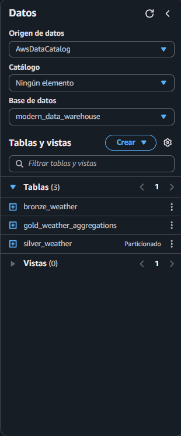

# Modern Data Stack - Portfolio Project

This is a data engineering project I built to learn AWS and demonstrate how to build a data warehouse from scratch. The idea was to implement a "medallion architecture" where data flows through different quality layers - from raw to cleaned to aggregated.

## What This Does

Basically, the project pulls weather data (and can pull stock market data too), stores it in AWS S3, cleans it up using Python/Pandas, and makes it queryable with SQL through AWS Athena. I organized the data into three layers:

- **Bronze**: Raw data exactly as it comes from the API
- **Silver**: Cleaned up and standardized, with bad data removed
- **Gold**: Aggregated metrics ready for analysis

The whole thing costs $0/month since it runs on AWS free tier.

## Tech Stack

I used Python for most of the data processing. Here's what else is in here:

- **AWS S3** for storing all the data
- **AWS Athena** to query the data with SQL
- **Pandas** for data transformations (originally wanted to use PySpark but Pandas worked better for this scale)
- **Docker** to run Airflow and PostgreSQL locally
- **Git** for version control

## Project Structure

The repo is organized like this:

```
modern-data-stack/
├── src/                    # Main Python code
│   ├── ingestion/         # Scripts to pull data from APIs
│   ├── transformation/    # Bronze→Silver→Gold transforms
│   └── utils/             # Helper functions for S3, logging, etc.
├── scripts/               # Automation scripts for AWS setup
├── airflow/dags/          # Airflow DAGs for orchestration
├── sql/                   # SQL queries for Athena
├── config/                # Configuration templates
└── docs/                  # Setup guides
```

## How to Set This Up

If you want to run this yourself, here's what you need:

### 1. AWS Setup

You'll need an AWS account. Then:

```bash
# Install dependencies
pip install -r requirements-minimal.txt

# Configure AWS credentials
# Either use: aws configure
# Or run: python scripts/setup_aws_credentials.py

# Create the S3 buckets
python scripts/setup_aws_buckets.py
```

This creates 4 buckets: one for each data layer (bronze/silver/gold) plus one for Athena query results.

### 2. Get Some Data

The project includes a script that generates synthetic weather data for testing:

```bash
python scripts/simple_upload_test_data.py
```

This uploads data for New York, London, Tokyo, and Buenos Aires to the Bronze layer.

If you want real data, you'll need API keys from:
- OpenWeatherMap (free at openweathermap.org/api)
- Alpha Vantage (free at alphavantage.co)

Then update `config/database_config.yaml` with your keys.

### 3. Run the Transformations

This processes the raw data into cleaned and aggregated formats:

```bash
python scripts/pandas_transformation.py
```

This reads from Bronze, cleans the data, and writes to both Silver and Gold layers.

### 4. Query with SQL

Set up Athena tables:

```bash
python scripts/setup_athena_all_layers.py
python scripts/configure_athena_output.py
```

Then you can query your data at console.aws.amazon.com/athena:

```sql
SELECT city_name, avg_temperature, avg_humidity
FROM modern_data_warehouse.gold_weather_aggregations;
```

### Screenshots

**Athena Query Interface**  
Running SQL queries on the Gold layer:


**Database Tables**  
Bronze, Silver, and Gold layers in Athena:



> **Note**: To add your own screenshots, take screenshots from your AWS Athena console and save them in the `images/` folder with the names shown above.

## What I Learned

Building this taught me a lot about:

- How to structure a data pipeline (Bronze/Silver/Gold is actually pretty elegant)
- AWS S3 and Athena - way more powerful than I expected
- Why Parquet format matters (saved 70% storage vs JSON)
- Data partitioning for performance
- Handling API rate limits and errors
- The importance of data quality checks

## Some Technical Details

**Why Pandas instead of PySpark?** Initially wanted to use PySpark for the "big data" experience, but for this data volume Pandas was simpler and worked better on Windows. The transformation logic is the same either way.

**Why synthetic data?** OpenWeatherMap API keys can take hours to activate. The synthetic data generator creates realistic weather data instantly and works great for demos.

**Cost optimization**: Parquet with Snappy compression + partitioning by country keeps queries fast and storage minimal. The whole thing stays comfortably in AWS free tier.

## Future Ideas

Things I might add:

- Real-time streaming with Kinesis
- More data sources (maybe social media sentiment)
- dbt for SQL transformations
- Dashboard with QuickSight
- CI/CD pipeline with GitHub Actions

## Files Worth Checking Out

- `scripts/pandas_transformation.py` - Main ETL logic
- `sql/analytical_queries.sql` - Example queries showing what you can do with the data
- `src/utils/s3_utils.py` - Wrapper around boto3 for easier S3 operations
- `airflow/dags/` - DAG definitions for automation

## Running Locally

If you want to run Airflow locally:

```bash
docker-compose up -d
```

Then go to localhost:8080 (user: admin, pass: admin)

## Contact

Francisco Puyó G.  
Email: fr.puyog@gmail.com  
LinkedIn: [Francisco Puyó Gallardo](https://linkedin.com/in/fr-puyog)  
GitHub: [@fpuyog](https://github.com/fpuyog)

---

Built this as a portfolio project to demonstrate data engineering concepts. Feel free to fork it or reach out if you have questions!
